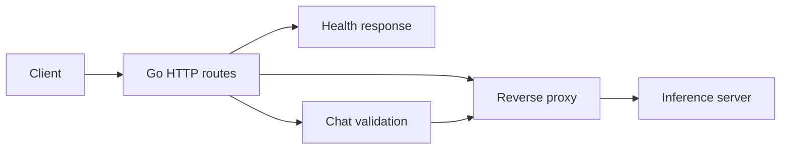

# llmgate

`llmgate` is an OpenAI-compatible LLM gateway written in Go. It accepts HTTP
requests and forwards them to one inference server, such as llama.cpp. The
backend loads the model and generates tokens; the gateway handles HTTP routing,
request validation, cancellation, and deadlines.

Phase 1 is in progress. Health checks, model listing, and non-streaming chat
work today. Streaming, authentication, rate limits, usage tracking, metrics,
and Docker Compose are still planned. Benchmarks are not available yet.

## Run locally

Use Go 1.27 or later and an already-running OpenAI-compatible backend. Set the
backend's base URL without the `/v1` suffix:

```sh
GATEWAY_UPSTREAM_URL=http://127.0.0.1:8081 go run ./cmd/gateway
```

The gateway listens on port 8080 by default. In another terminal:

```sh
curl http://localhost:8080/v1/healthz
curl http://localhost:8080/v1/models

# Replace MODEL_ID with an ID returned by /v1/models.
curl http://localhost:8080/v1/chat/completions \
  -H 'Content-Type: application/json' \
  -d '{"model":"MODEL_ID","messages":[{"role":"user","content":"Hello"}],"stream":false}'
```

Without `GATEWAY_UPSTREAM_URL`, the process still starts. Health returns `200`,
while model and chat requests return `503`. Health checks only the gateway
process, not backend availability.

## How a request works



1. Go's `http.ServeMux` matches the method and path. The gateway exposes
   `GET /v1/healthz`, `GET /v1/models`, and `POST /v1/chat/completions`.
2. For chat, the handler reads the body into a bounded buffer. It requires
   `application/json`, a JSON object, and a boolean `stream` field when present.
   `stream: true` returns `501` until streaming is implemented.
3. The handler forwards the original JSON bytes, preserving backend-specific
   fields. The backend validates the model, messages, and generation options.
4. The standard library's `httputil.ReverseProxy` sends the request upstream and
   copies the backend's status, response headers, and body back to the client.
   Model-list requests use this proxy directly.

The proxy derives its deadline from the incoming request's Go `context`, which
carries cancellation signals. A client disconnect cancels upstream HTTP work.
The upstream timeout covers both waiting for headers and reading the response
body. Before headers arrive, a timeout returns `504` and a connection failure
returns `502`. After a response starts, a failure ends the incomplete response;
the gateway cannot replace a status it has already sent. Backend HTTP errors
pass through unchanged.

On `SIGINT` or `SIGTERM`, the gateway stops accepting connections and gives
active requests time to finish. It closes remaining connections when the
shutdown deadline expires.

## Configuration

| Environment variable | Default | Controls |
| --- | --- | --- |
| `GATEWAY_ADDR` | `:8080` | Listen address |
| `GATEWAY_UPSTREAM_URL` | Unset | Backend base URL |
| `GATEWAY_UPSTREAM_TIMEOUT` | `30s` | Total upstream request deadline |
| `GATEWAY_MAX_BODY_BYTES` | `1048576` | Chat request body limit |
| `GATEWAY_READ_TIMEOUT` | `10s` | Incoming headers and body read deadline |
| `GATEWAY_READ_HEADER_TIMEOUT` | `5s` | Incoming header read deadline |
| `GATEWAY_IDLE_TIMEOUT` | `60s` | Wait for the next request on an idle client connection |
| `GATEWAY_SHUTDOWN_TIMEOUT` | `10s` | Graceful shutdown deadline |

Oversized chat bodies return `413`, invalid JSON returns `400`, and unsupported
content types return `415`. Duration settings accept Go values such as `500ms`
or `30s` and must be positive.

## Read the code

Start with [startup](cmd/gateway/run.go), then follow the
[routes](internal/gateway/handler.go), [chat validation](internal/gateway/chat.go),
and [proxy](internal/proxy/handler.go). See [shutdown](cmd/gateway/server.go) for
connection cleanup. The implementation uses only the Go standard library.

Run the tests with:

```sh
go test ./...
```

[Design decisions](docs/decisions.md) records the current tradeoffs.
[Project intent](docs/PROJECT_INTENT.md) describes the remaining Phase 1 work
and later plans for multiple backends and prefix-aware routing.
